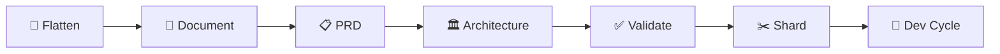

# 🚀 BMAD Method Command Reference Guide

> **✨ The Ultimate Guide to BMad Method Commands & Workflows**

---

## 📋 Table of Contents

- [🎯 Quick Start](#-quick-start)
- [🛠️ Initial Setup](#️-initial-setup)
- [🎨 Planning Phase](#-planning-phase)
- [💻 Development Phase](#-development-phase)
- [🔄 Complete Workflows](#-complete-workflows)
- [⚡ Utility Commands](#-utility-commands)
- [📝 Important Notes](#-important-notes)

---

## 🎯 Quick Start

### 🏃‍♂️ Current Project Status
```bash
# ✅ Story 1.1 is DONE! Next immediate command:
@sm → *draft                    # Create Story 1.2
```

### 🌟 Most Common Commands
| Agent | Command | Purpose |
|-------|---------|---------|
| **SM** | `*draft` | Create next story |
| **Dev** | `Implement story X.Y from docs/stories/X.Y.story.md` | Build feature |
| **QA** | `Review story X.Y implementation` | Quality check |
| **PO** | `*execute-checklist-po` | Validate alignment |

---

## 🛠️ Initial Setup

### 📦 Installation & Preparation

```bash
# 🎉 Install BMAD Method in your project
npx bmad-method install

# 📄 Flatten project for web agents (Gemini/Claude web)
npx bmad-method flatten
```

> **💡 Pro Tip**: Use `flatten` when working with Gemini's 1M+ token context!

---

## 🎨 Planning Phase Commands

### 🔍 Analyst Agent
**Role**: Research & Analysis Expert

```bash
@analyst
┌─────────────────────────────────────────────────┐
│ 🧠 ANALYST COMMANDS                             │
├─────────────────────────────────────────────────┤
│ *help                 # 📚 Show commands        │
│ *document-project     # 📝 Document codebase    │
│ *brainstorm          # 💭 Brainstorming        │
│ *market-research     # 📊 Market analysis      │
│ *competitor-analysis # 🏆 Competition study    │
│ *create-brief        # 📋 Project brief        │
│ *exit                # 👋 Exit mode            │
└─────────────────────────────────────────────────┘
```

### 📊 PM (Project Manager) Agent
**Role**: Requirements & Story Management

```bash
@pm
┌─────────────────────────────────────────────────┐
│ 📋 PROJECT MANAGER COMMANDS                     │
├─────────────────────────────────────────────────┤
│ *help                    # 📚 Show commands     │
│ *create-prd             # 📄 New PRD           │
│ *create-brownfield-prd  # 🏗️ Existing project │
│ *create-brownfield-epic # 📌 Single epic      │
│ *create-brownfield-story# 📝 Single story     │
│ *shard                  # ✂️ Split documents   │
│ *exit                   # 👋 Exit mode         │
└─────────────────────────────────────────────────┘
```

### 🏛️ Architect Agent
**Role**: System Design & Documentation

```bash
@architect
┌─────────────────────────────────────────────────┐
│ 🏗️ ARCHITECT COMMANDS                          │
├─────────────────────────────────────────────────┤
│ *help                          # 📚 Show cmds   │
│ *create-architecture          # 🏛️ New arch    │
│ *create-brownfield-architecture# 🔧 Existing   │
│ *document-project             # 📖 Document    │
│ *shard                        # ✂️ Split docs  │
│ *exit                         # 👋 Exit mode   │
└─────────────────────────────────────────────────┘
```

### 👔 PO (Product Owner) Agent
**Role**: Alignment & Validation

```bash
@po
┌─────────────────────────────────────────────────┐
│ ✅ PRODUCT OWNER COMMANDS                       │
├─────────────────────────────────────────────────┤
│ *help                  # 📚 Show commands       │
│ *execute-checklist-po  # ✔️ Run checklist      │
│ *shard <filepath>      # ✂️ Shard document     │
│ *validate-next-story   # 🔍 Check story        │
│ *exit                  # 👋 Exit mode          │
└─────────────────────────────────────────────────┘
```

---

## 💻 Development Phase Commands

### 🏃 SM (Scrum Master) Agent
**Role**: Story Creation & Sprint Management

```bash
@sm
┌─────────────────────────────────────────────────┐
│ 🏃 SCRUM MASTER COMMANDS                        │
├─────────────────────────────────────────────────┤
│ *help             # 📚 Show commands            │
│ *draft            # ✍️ Create next story        │
│ *correct-course   # 🧭 Course correction        │
│ *story-checklist  # ✅ Validate story          │
│ *exit             # 👋 Exit mode               │
└─────────────────────────────────────────────────┘
```

### 👨‍💻 Dev (Developer) Agent
**Role**: Implementation & Coding

```bash
@dev
┌─────────────────────────────────────────────────┐
│ 💻 DEVELOPER COMMANDS                           │
├─────────────────────────────────────────────────┤
│ *help                           # 📚 Show cmds  │
│ Implement story X.Y from [path] # 🔨 Build     │
│ Fix the bug in [file]          # 🐛 Debug      │
│ Add feature X                  # ✨ New feat   │
│ *exit                          # 👋 Exit mode  │
└─────────────────────────────────────────────────┘
```

### 🔍 QA (Quality Assurance) Agent
**Role**: Code Review & Testing

```bash
@qa
┌─────────────────────────────────────────────────┐
│ 🔍 QA COMMANDS                                  │
├─────────────────────────────────────────────────┤
│ *help                        # 📚 Show commands │
│ Review story X.Y impl        # 👀 Review code  │
│ Review code in [file]        # 🔎 Check file   │
│ Run tests                    # 🧪 Test suite   │
│ *exit                        # 👋 Exit mode    │
└─────────────────────────────────────────────────┘
```

### 🎯 Special Agents

#### 🌟 BMad-Master (Universal Agent)
**Role**: Can execute any non-dev command

```bash
@bmad-master
┌─────────────────────────────────────────────────┐
│ 🌟 BMAD MASTER - Universal Access               │
├─────────────────────────────────────────────────┤
│ *help     # Shows ALL available commands        │
│           # Access to all agents except dev     │
└─────────────────────────────────────────────────┘
```

---

## 🔄 Complete Workflows

### 🏗️ Brownfield Development Workflow



#### 📊 Phase 1: Documentation
```bash
# 1️⃣ Prepare for web upload
npx bmad-method flatten

# 2️⃣ Document existing system
@architect → *document-project
```

#### 🎯 Phase 2: Planning
```bash
# 3️⃣ Create enhancement PRD
@pm → *create-brownfield-prd

# 4️⃣ Design integration architecture
@architect → *create-brownfield-architecture

# 5️⃣ Validate alignment
@po → *execute-checklist-po
```

#### 💾 Phase 3: IDE Transition
```bash
# 6️⃣ Save documents
docs/brownfield-prd.md
docs/brownfield-architecture.md

# 7️⃣ Shard PRD
@po → shard docs/brownfield-prd.md

# 8️⃣ Shard architecture
@po → shard docs/brownfield-architecture.md
```

#### 🚀 Phase 4: Development Cycle
```bash
# 🔄 REPEAT FOR EACH STORY:
┌─────────────────────────────────────────┐
│ 1. @sm → *draft          # Create story │
│ 2. "Story approved"      # Approve it   │
│ 3. @dev → Implement...   # Build it     │
│ 4. @qa → Review...       # Check it     │
│ 5. git commit -m "..."   # Save it      │
│ 6. Go to step 1          # Next story   │
└─────────────────────────────────────────┘
```

---

## ⚡ Utility Commands

### 🔧 Project Management
```bash
# 📁 Check story status
ls docs/stories/*.story.md

# 🌿 View git status
git status

# 💾 Commit changes
git add .
git commit -m "feat: implement story X.Y"
```

### 🧪 Testing & Validation
```bash
# 🐍 Python projects
python -m pytest
python test_*.py

# 📦 Node.js projects
npm test
npm run test:coverage
```

### 📊 Monitoring & Logs
```bash
# 📜 View logs
tail -f logs/*.log

# 🔍 Search logs
grep ERROR logs/*.log

# 📈 Check performance
htop
```

---

## 📝 Important Notes

### ⚠️ Critical Rules

> **🛑 STOP**: Always commit after completing each story!

1. **One Story at a Time** 📌
   - Complete → Test → Commit → Next

2. **Command Prefixes** 🏷️
   - `*command` = Agent-specific command
   - Plain text = Natural language request
   - `@agent` = Switch agents (some IDEs use `/agent`)

3. **Story Status Flow** 📊
   ```
   Draft → In Progress → Ready for Review → Done
   ```

4. **Never Skip** ⏭️
   - User approval before dev
   - Testing before marking done
   - Commit before next story

### 💡 Pro Tips

| Tip | Description |
|-----|-------------|
| 🎯 | Use `@bmad-master` for everything except coding |
| 📝 | Keep stories small and focused |
| 🔄 | Regular commits = easier rollbacks |
| 📊 | Check story status before creating new ones |
| 🧪 | Test locally before marking complete |

### 🚨 Common Mistakes to Avoid

- ❌ Creating multiple stories before implementing
- ❌ Skipping QA review on complex features
- ❌ Forgetting to commit before next story
- ❌ Using dev agent for planning tasks
- ❌ Implementing without approved story

---

## 🎉 Success Checklist

Before moving to next story:
- [ ] ✅ Story implemented completely
- [ ] 🧪 All tests passing
- [ ] 📝 Story status updated to "Done"
- [ ] 💾 Changes committed to git
- [ ] 🔍 No linting errors

---

> **🌟 Remember**: BMad Method = **B**etter **M**anaged **A**gile **D**evelopment!

---

*Last Updated: July 31, 2025 | Version: 2.0 Enhanced*