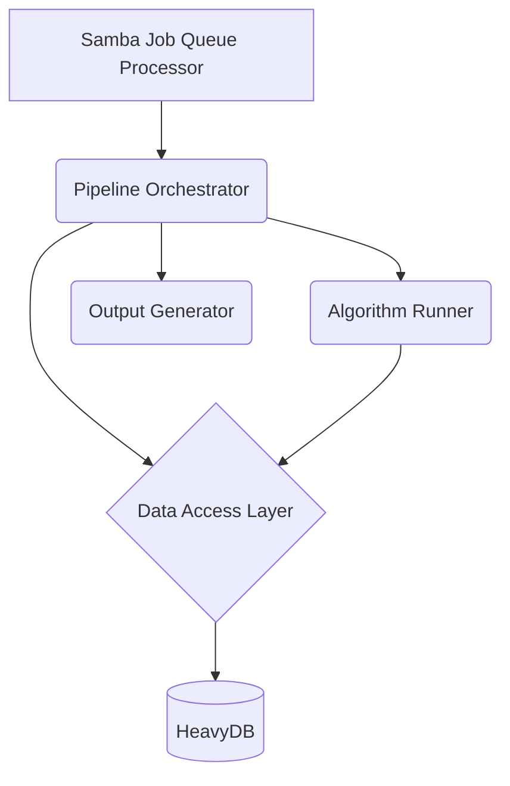

# Heavy Optimizer Platform Brownfield Enhancement Architecture

## 1. Introduction

This document outlines the architectural approach for enhancing the Heavy Optimizer Platform. Its primary goal is to serve as the guiding architectural blueprint for evolving the existing file-based Python optimizer into the fully integrated, database-driven, GPU-accelerated system depicted in the `updated_optimization_zone_v1.png` architecture diagram.

**Relationship to Existing Architecture:**
This document supplements the existing project architecture by defining how new components will integrate with the current system. Where conflicts arise between new and existing patterns, this document provides guidance on maintaining consistency while implementing enhancements.

### 1.1. Existing Project Analysis

#### 1.1.1. Current Project State

- **Primary Purpose:** To provide professional-grade portfolio optimization using a suite of 8 different algorithms and 5 financial metrics.
- **Current Tech Stack:** Python, Pandas, NumPy, with an optional TensorFlow hook for GPU acceleration.
- **Architecture Style:** A file-based, in-memory monolithic script (`Optimizer_New_patched.py`).
- **Deployment Method:** Manual execution of the Python script, with input/output via a Samba share.

#### 1.1.2. Available Documentation

- `docs/mermid/updated_optimization_zone_v1.png`: The target architecture diagram.
- `docs/prd.md`: The Product Requirements Document for this enhancement.

#### 1.1.3. Identified Constraints

- The system must maintain backward compatibility with existing Windows clients and CSV input formats.
- The core data flow sequence (ULTA -> Correlation -> Algorithm) must be preserved.
- The specific implementation details of the 8 optimization algorithms must be preserved.

### 1.2. Change Log

| Change | Date | Version | Description | Author |
| :--- | :--- | :--- | :--- | :--- |
| Initial Draft | 2025-07-30 | 1.0 | First version of the architecture document. | Winston |

## 2. Enhancement Scope and Integration Strategy

### 2.1. Enhancement Overview

- **Enhancement Type:** New Feature Addition, Major Feature Modification, Performance/Scalability Improvements
- **Scope:** This enhancement will focus on improving the integration, data flow, monitoring, and performance of the Heavy Optimizer Platform. Key areas of improvement include adding real-time monitoring, enhancing GPU memory management, improving the correlation analysis and ensemble voting mechanisms, adding robust error handling, and implementing performance profiling for each algorithm.
- **Integration Impact:** Significant Impact (substantial existing code changes)

### 2.2. Integration Approach

- **Code Integration Strategy:** The existing Python script will be refactored into a modular, multi-component system. The core logic of the algorithms and pre-processing steps will be preserved, but the data access and execution will be re-engineered to use HeavyDB.
- **Database Integration:** HeavyDB will be introduced as the primary data store. All data will be loaded into HeavyDB, and all pre-processing and optimization steps will be executed as queries against the database.
- **API Integration:** A new REST API will be created to expose the real-time monitoring data.
- **UI Integration:** N/A

### 2.3. Compatibility Requirements

- **Existing API Compatibility:** N/A
- **Database Schema Compatibility:** N/A (new database)
- **UI/UX Consistency:** N/A
- **Performance Impact:** The enhanced system must meet or exceed the performance benchmarks of the legacy system.

## 3. Tech Stack Alignment

### 3.1. Existing Technology Stack

| Category | Current Technology | Version | Usage in Enhancement | Notes |
| :--- | :--- | :--- | :--- | :--- |
| Language | Python | 3.x | The primary language for the entire system. | |
| Data | Pandas/NumPy | latest | Will be used for data manipulation before loading into HeavyDB. | |
| GPU | TensorFlow | latest | Will be replaced with CuPy/CUDA for direct GPU acceleration. | |

### 3.2. New Technology Additions

| Technology | Version | Purpose | Rationale | Integration Method |
| :--- | :--- | :--- | :--- | :--- |
| HeavyDB | latest | Primary data store and GPU-accelerated query engine. | To meet the performance and scalability requirements of the target architecture. | A new data access layer will be created to interact with HeavyDB. |
| CuPy | latest | GPU-accelerated numerical computation. | To perform GPU-accelerated calculations that are not suitable for HeavyDB. | Will be used in the new data access layer and algorithm implementations. |
| FastAPI | latest | To create the real-time monitoring REST API. | A lightweight, high-performance web framework for Python. | A new API server will be created using FastAPI. |

## 4. Data Models and Schema Changes

### 4.1. New Data Models

#### 4.1.1. `strategies_python_multi_consolidated`

- **Purpose:** To store the daily returns of all trading strategies.
- **Integration:** This table will be the primary source of data for all pre-processing and optimization steps.
- **Key Attributes:**
    - `Date`: DATE - The date of the trading day.
    - `Zone`: VARCHAR - The trading zone.
    - `Day`: VARCHAR - The day of the week.
    - `strategy_...`: FLOAT - A column for each trading strategy.
- **Relationships:** N/A

### 4.2. Schema Integration Strategy

- **Database Changes Required:**
    - **New Tables:** `strategies_python_multi_consolidated`
    - **Modified Tables:** N/A
    - **New Indexes:** N/A
    - **Migration Strategy:** Data will be loaded from the source CSV files into the new table using a custom script.
- **Backward Compatibility:** The schema of the input CSV files will not be changed.

## 5. Component Architecture

### 5.1. New Components

#### 5.1.1. Samba Job Queue Processor

- **Responsibility:** To monitor the Samba share for new job requests and to initiate the optimization pipeline.
- **Integration Points:** The processor will call the Pipeline Orchestrator to start a new optimization job.
- **Key Interfaces:** N/A
- **Dependencies:** Pipeline Orchestrator
- **Technology Stack:** Python

#### 5.1.2. Pipeline Orchestrator

- **Responsibility:** To manage the end-to-end data flow of the optimization pipeline.
- **Integration Points:** The orchestrator will be called by the Samba Job Queue Processor and will call the Data Access Layer, the Algorithm Runner, and the Output Generator.
- **Key Interfaces:** `start_optimization_job()`
- **Dependencies:** Data Access Layer, Algorithm Runner, Output Generator
- **Technology Stack:** Python

#### 5.1.3. Data Access Layer

- **Responsibility:** To abstract all interactions with the HeavyDB database.
- **Integration Points:** The DAL will be called by the Pipeline Orchestrator and the Algorithm Runner.
- **Key Interfaces:** `load_data()`, `apply_ulta()`, `compute_correlation_matrix()`, `run_query()`
- **Dependencies:** HeavyDB
- **Technology Stack:** Python, CuPy

#### 5.1.4. Algorithm Runner

- **Responsibility:** To execute the 8 optimization algorithms in parallel.
- **Integration Points:** The runner will be called by the Pipeline Orchestrator and will call the Data Access Layer.
- **Key Interfaces:** `run_algorithms()`
- **Dependencies:** Data Access Layer
- **Technology Stack:** Python

#### 5.1.5. Output Generator

- **Responsibility:** To generate the 8 specific output files.
- **Integration Points:** The generator will be called by the Pipeline Orchestrator.
- **Key Interfaces:** `generate_outputs()`
- **Dependencies:** N/A
- **Technology Stack:** Python

### 5.2. Component Interaction Diagram



## 6. API Design and Integration

### 6.1. API Integration Strategy

- **API Integration Strategy:** A new REST API will be created to expose the real-time monitoring data.
- **Authentication:** N/A (the API will be internal)
- **Versioning:** N/A

### 6.2. New API Endpoints

#### 6.2.1. `/status`

- **Method:** GET
- **Endpoint:** `/status`
- **Purpose:** To get the current status of the optimization pipeline.
- **Integration:** The API will query the Pipeline Orchestrator for the latest status.
- **Request:** N/A
- **Response:**
```json
{
  "status": "running",
  "progress": 50,
  "current_step": "Running Genetic Algorithm"
}
```

## 7. Risks and Mitigation

| Risk | Mitigation Strategy |
|:---|:---|
| **HeavyDB Integration Complexity** | Develop a dedicated data access layer (DAL) to abstract HeavyDB interactions. Create a suite of integration tests to validate each query and data transformation step independently. |
| **Maintaining Performance Benchmarks** | Implement continuous performance profiling. Benchmark each component before and after changes. Optimize critical queries and data transfer operations. |
| **GPU Memory Overflow** | Implement the intelligent GPU memory manager with proactive memory estimation and garbage collection. Add configuration limits to prevent runaway memory usage. |
| **Breaking Existing Windows Client Workflows** | Maintain the exact same Samba share path and CSV input/output formats. Conduct end-to-end testing from a Windows client environment to validate workflows. |
